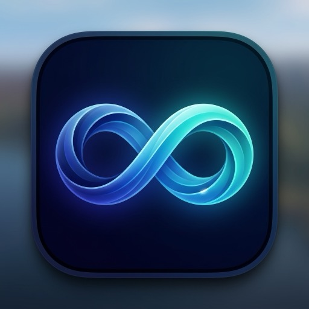

<div align="center">
  
  <h1>AeroLoop</h1>
  <p><b>Beautiful, dynamic video wallpapers and screensavers for macOS.</b></p>
  
  [](https://apple.com/macos)
  [](https://opensource.org/licenses/MIT)
  [](https://swift.org)
</div>

<br>

AeroLoop brings your macOS desktop to life with high-performance, battery-efficient live video wallpapers. Built natively with Swift and AVFoundation, it integrates seamlessly as both a desktop wallpaper and a native macOS Screen Saver.

## ✨ Features
*   **Live Desktop Wallpapers**: Play looping `.mp4` and `.mov` files directly on your desktop background.
*   **Native Screen Saver**: AeroLoop installs a `.saver` plugin so your wallpapers can run when you step away.
*   **Battery & Performance Smart**: Automatically pauses playback when on battery power or when another app is in native Fullscreen mode.
*   **Multi-Display Support**: Sync wallpapers across all monitors or set unique loops per display.
*   **Day/Night Scheduling**: Automatically switch playlists based on the macOS system appearance (Light/Dark mode).
*   **App Sandbox Compliant**: Built with security in mind, fully embracing macOS App Groups and Sandboxing.

## 🚀 Installation

### Download from the App Store
The easiest way to get AeroLoop is to download the compiled, code-signed, and verified version directly from the Mac App Store:

👉 **[Download on the Mac App Store](https://aeroloop.app)** 

### Build from Source
If you prefer to build it yourself, you'll need Xcode 15+ and macOS 13.0+.

1. Clone the repository:
   ```bash
   git clone https://github.com/YOUR-USERNAME/AeroLoop.git
   cd AeroLoop
   ```
2. Generate the Xcode project using [XcodeGen](https://github.com/yonaskolb/XcodeGen):
   ```bash
   xcodegen generate
   ```
3. Open `AeroLoop.xcodeproj`.
4. Update the **Team ID** in `project.yml` or the Xcode signing settings to your own Apple Developer account if you intend to archive it.
5. Build and run!

## 🛠 Architecture & Development
AeroLoop uses a modern, local-first Swift architecture. 
*   **Database**: Managed by [GRDB.swift](https://github.com/groue/GRDB.swift).
*   **Project Generation**: Managed by `project.yml` via XcodeGen (do not edit `.xcodeproj` manually).
*   **Cross-Process Sharing**: The main app and the Screen Saver plugin share data securely through a macOS App Group container (`group.com.greekerlabs.aeroloop`).

For a deep dive into how the app works, see [ARCHITECTURE.md](ARCHITECTURE.md).

## 🤝 Contributing
We welcome contributions! Whether it's bug reports, feature requests, or pull requests. 
1. Check out the [Contributing Guidelines](CONTRIBUTING.md).
2. Please adhere to the [Code of Conduct](CODE_OF_CONDUCT.md).

## ☕️ Support & Donations
AeroLoop is free and open-source. If you enjoy the app and want to support its ongoing development, consider buying me a coffee or sponsoring the project!

*   [Buy Me a Coffee](https://buymeacoffee.com/YOUR-USERNAME)
*   [GitHub Sponsors](https://github.com/sponsors/YOUR-USERNAME)

## 📄 License
This project is licensed under the MIT License - see the [LICENSE](LICENSE) file for details.
